# shark-movement-story-map-demo

[](https://github.com/ranjithguggilla/shark-movement-story-map-demo/actions/workflows/ci.yml)


Shark movement story map — temporal playback, environmental context, science communication layer.

## Demo media

Streamlit app (**`streamlit run app.py`**). Synthetic demonstration tracks only.

### Walkthrough GIF

After you convert a screen recording, save it as **`assets/gifs/demo-overview.gif`** and uncomment the line below (or add ``).

<!-- 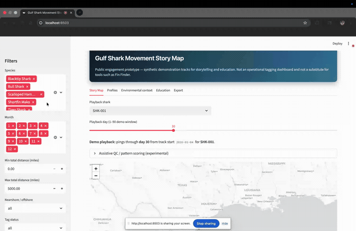 -->

### Screenshots

<details>
<summary><strong>Expand: 14 UI screenshots</strong> (story map → profiles → environmental → education → export)</summary>

| View | Preview |
|------|---------|
| Story Map — filters + QC legend | 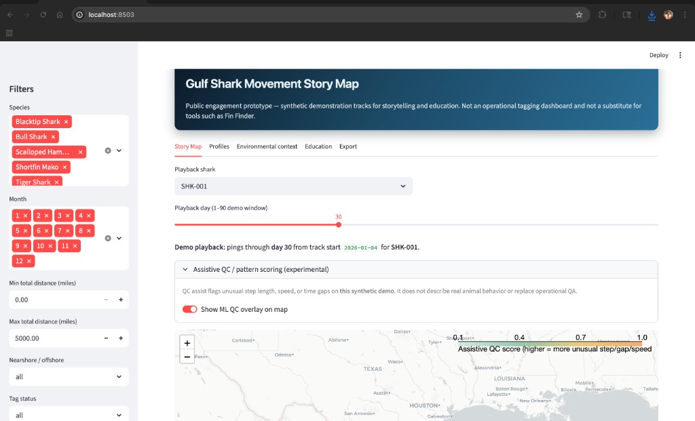 |
| Story Map — playback + ML QC overlay | 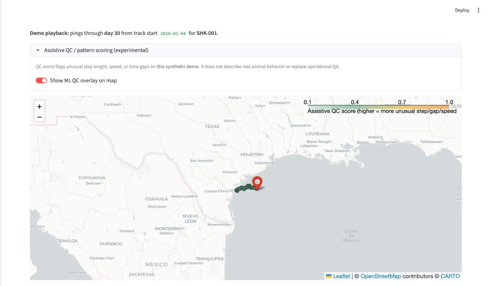 |
| Animated playback (Plotly) | 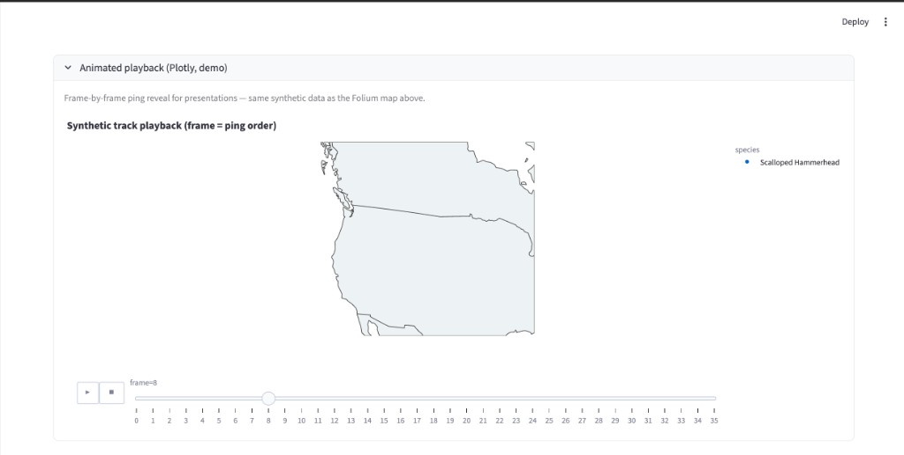 |
| Journey summary + optional AI wording | 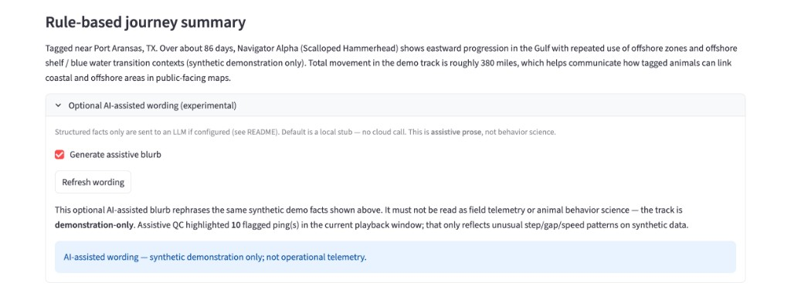 |
| Story Map — latest ping popup | 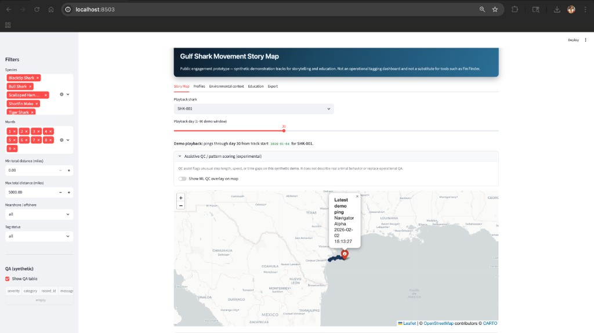 |
| Profiles — Navigator Alpha | 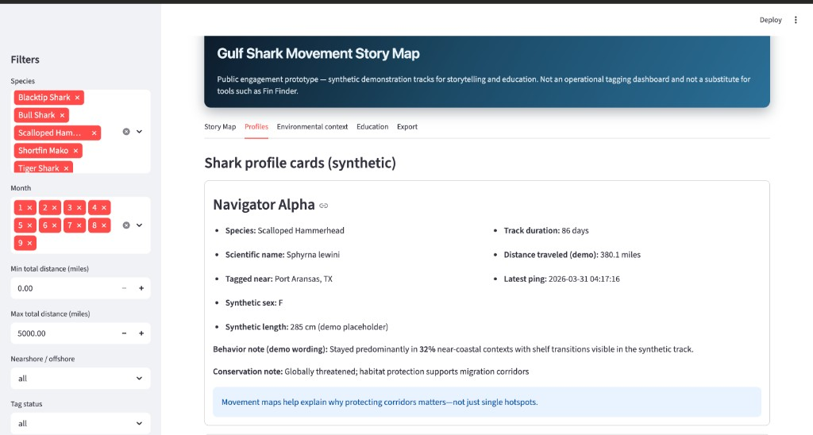 |
| Profiles — Tiger & Mako cards | 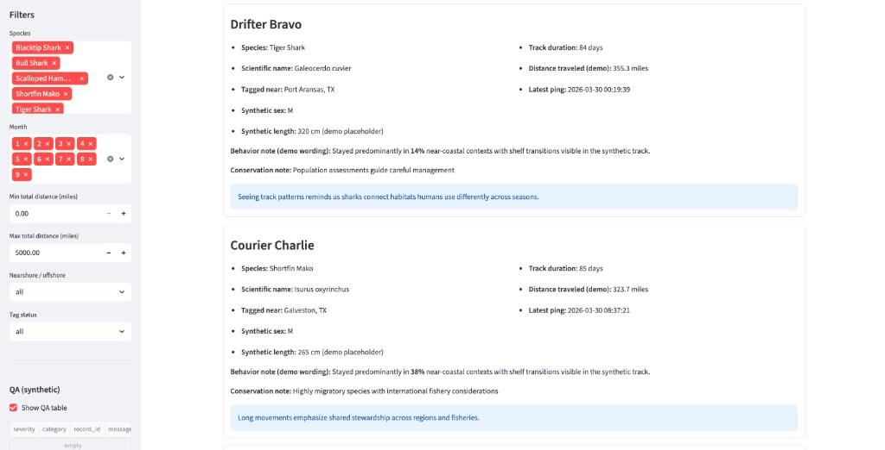 |
| Profiles — Blacktip & Bull cards | 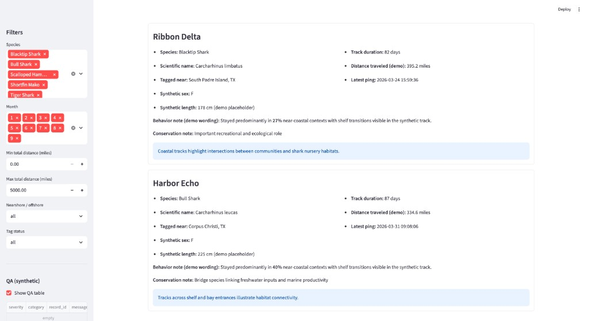 |
| Environmental context — playback row | 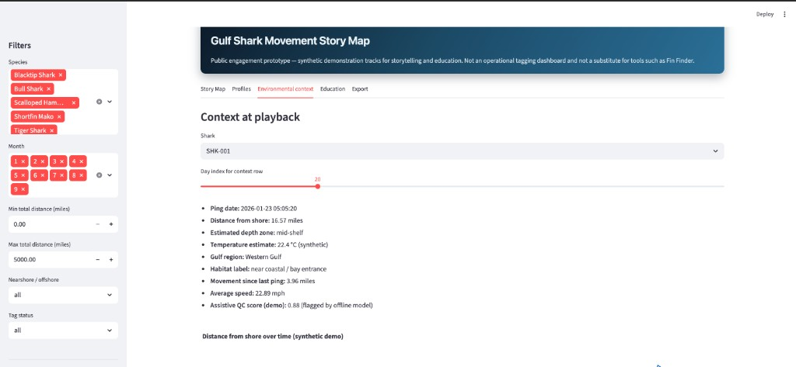 |
| Environmental — distance chart | 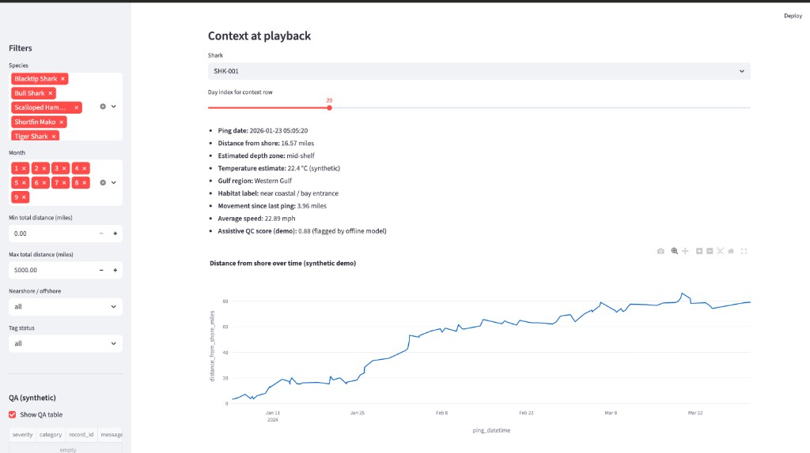 |
| Distance from shore over time | 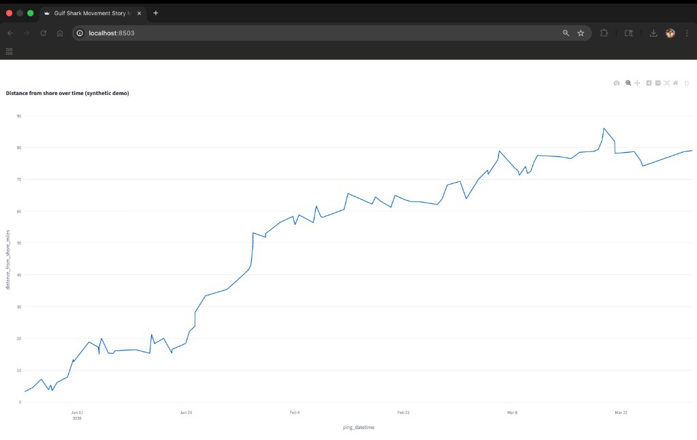 |
| Education — public context | 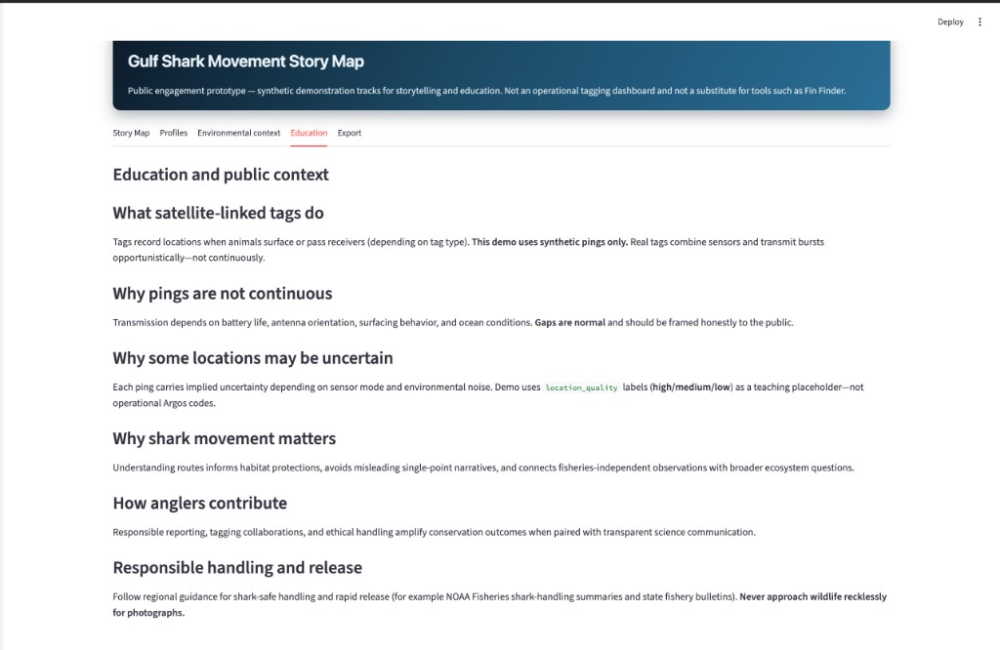 |
| Export — demo artifacts | 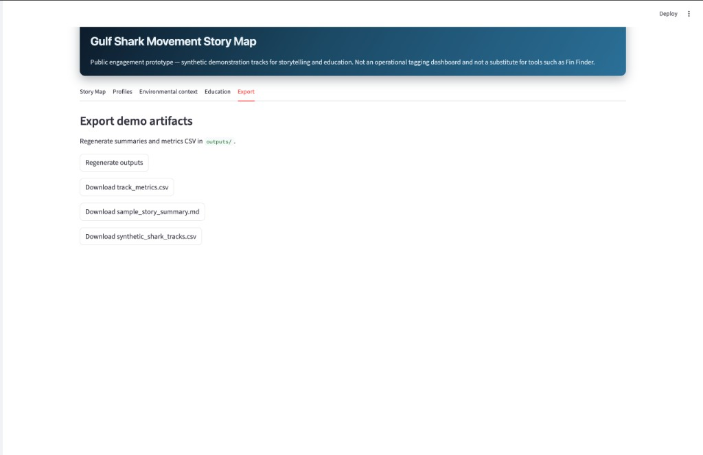 |
| Export — regenerated outputs | 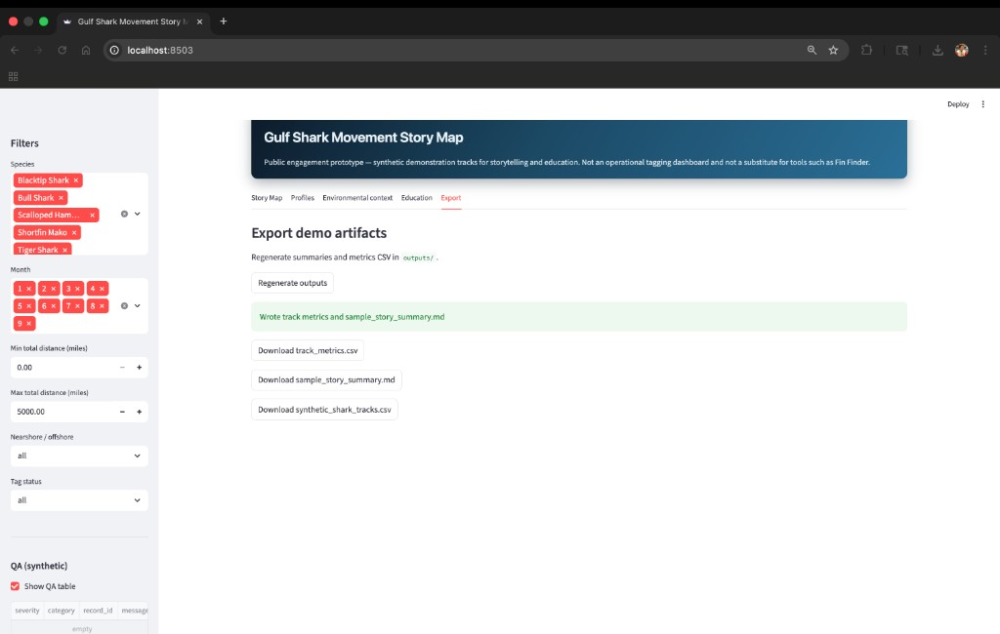 |

</details>

**GIF conversion (example):**

```bash
ffmpeg -hide_banner -loglevel error -y -i "/path/to/recording.webm" \
  -vf "fps=4,scale=900:-1:flags=lanczos,split[s0][s1];[s0]palettegen=max_colors=128:stats_mode=single[p];[s1][p]paletteuse=dither=bayer:bayer_scale=3" \
  assets/gifs/demo-overview.gif
```

## Positioning and constraints

This repository is a public-data-safe science communication prototype inspired by shark movement, tagging, and public engagement workflows. It does not use private or restricted program data and does not attempt to replace existing tools such as Fin Finder. The goal is to demonstrate how movement tracks can be presented with storytelling, environmental context, and education-focused summaries for public engagement.

Additional constraints:

- Uses **synthetic tracks only** in this demo dataset.
- Does **not** claim biological inference or abundance estimation.
- Does **not** replace Fin Finder or other operational tagging platforms—position this as a **story layer / education overlay** concept.
- If you ever incorporate non-synthetic sources, prefer **generalized or delayed locations** rather than sensitive near-real-time pinpointing.

Phase 2 additions (assistive only):

- **Offline ML QC (`src/ml_assist.py`):** Isolation Forest (or robust scoring on short tracks) on engineered movement features per ping — step length, time gap, implied speed, turn proxy, distance from shore. Outputs `ai_anomaly_score` and `qc_flag_ml` for **demo quality visualization**, not biological interpretation or operational QA replacement.
- **Optional LLM prose (`src/story_llm.py`):** Reformats structured JSON facts into short blurbs when configured; default is a **local stub** with no network call. Do **not** send raw coordinates or sensitive fields to external APIs without policy review.
- **UI copy:** Avoid claims such as “AI predicts where the shark goes next.” Prefer “assistive QC on synthetic demonstration tracks” and “experimental.”

## What this demonstrates

- Interactive Gulf-focused map with synthetic multi-species tracks.
- Time-based playback (day slider) to communicate movement over time.
- Shark profile cards with conservation-aware wording.
- Environmental context panel (distance-from-shore proxy, synthetic temperature, habitat labels—not operational ocean forecasts).
- Rule-based journey summaries (canonical); optional LLM-assisted wording when configured (experimental).
- Education panels for tagging uncertainty and responsible viewing expectations.

## Run locally

```bash
git clone https://github.com/ranjithguggilla/shark-movement-story-map-demo.git
cd shark-movement-story-map-demo
python3 -m pip install -r requirements.txt
python3 -m src.track_metrics
python3 -m src.story_generator
streamlit run app.py
```

If you already have the repo elsewhere, `cd` into that folder instead of cloning again.

Then open the local URL Streamlit prints (typically `http://localhost:8501`).

You can also use `make`:

```bash
make setup
make build-outputs
make run
```

**Contributors on GitHub:** this repo includes a `.githooks/commit-msg` script. After clone, run `git config core.hooksPath .githooks` once so your environment never appends `Co-authored-by` lines to commits (which GitHub counts as extra contributors). In Cursor, also disable any setting that adds Cursor as a co-author to commits.

## Quality checks

```bash
make smoke
```

GitHub Actions runs `scripts/smoke_test.py` on push and pull requests to `main`.

## Data files

- `data/synthetic_shark_tracks.csv` — synthetic pings.
- `data/species_profiles.csv` — species facts and public-facing messages.
- `data/conservation_notes.csv` — education copy.

## Outputs

- `outputs/track_metrics.csv`
- `outputs/sample_story_summary.md`

## Tech stack

Python, Streamlit, Folium, Pandas, GeoPandas, Shapely, Plotly, scikit-learn (offline QC features).

### Optional LLM configuration

| Variable | Purpose |
| --- | --- |
| `OPENAI_API_KEY` | If set, optional assistive prose uses the OpenAI API (`OPENAI_MODEL` defaults to `gpt-4o-mini`). |
| `OLLAMA_HOST` | If set (and no OpenAI key), e.g. `http://localhost:11434`, prose uses Ollama `OLLAMA_MODEL` (default `llama3.2`). |
| *(unset)* | Deterministic local stub text — no cloud call. |

Structured prompts exclude coordinate arrays; pair with organizational policy before enabling cloud providers.

### Optional theme

[`assets/theme.css`](assets/theme.css) is injected at startup for Streamlit layout polish.
